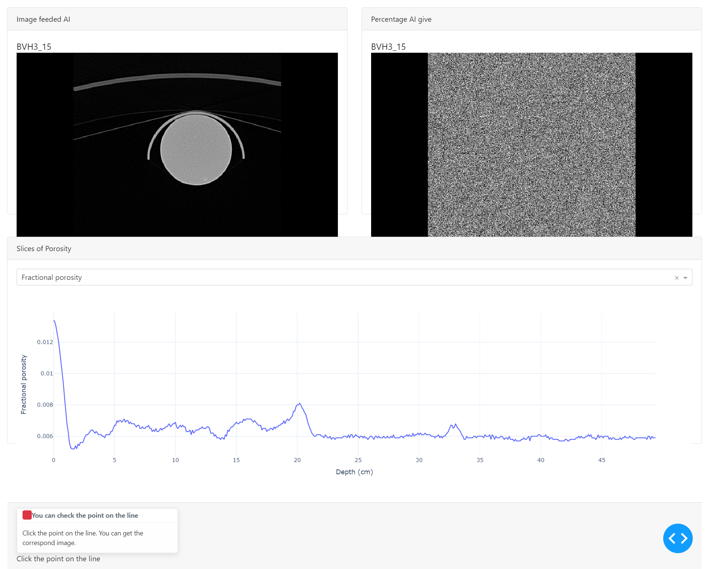

# Image and porosity analysis By Dash & plotly



## Demo

[demo video](https://youtu.be/HHs5iU_LHCc)

## Fork From

### Dash Exploration of COVID-19 chest X-ray CT images

### About this app

This app shows how to explore core data using Dash.

With this app, you can compare images in the first row and interact with a line chart in the second row. By hovering your mouse over a point on the line chart, detailed information will be displayed. Additionally, clicking on a point will update the images above, allowing you to see the corresponding images for that specific data point. This feature enables you to correlate the data from the line chart with the visual details in the images.

The data used in this app come from the dataset obtained from the wells affiliated with the Department of Resource Engineering at National Cheng Kung University in Taiwan.

### How to run this app

(The following instructions apply to Windows command line.)

To run this app first clone repository and then open a terminal to the app folder.

```
git clone https://github.com/JeffBla/Image-and-porosity-analysis-By-Dash-plotly.git
cd Image-and-porosity-analysis-By-Dash-plotly

```

Create and activate a new virtual environment (recommended) by running
the following:

On Windows

```
virtualenv venv
\venv\scripts\activate
```

Or if using linux

```bash
python3 -m venv myvenv
source myvenv/bin/activate
```

Install the requirements:

```
pip install -r requirements.txt
```

Run the app:

```
python app.py
```

You can run the app on your browser at http://127.0.0.1:8050

## Resources

To learn more about Dash, please visit [documentation](https://plot.ly/dash).
